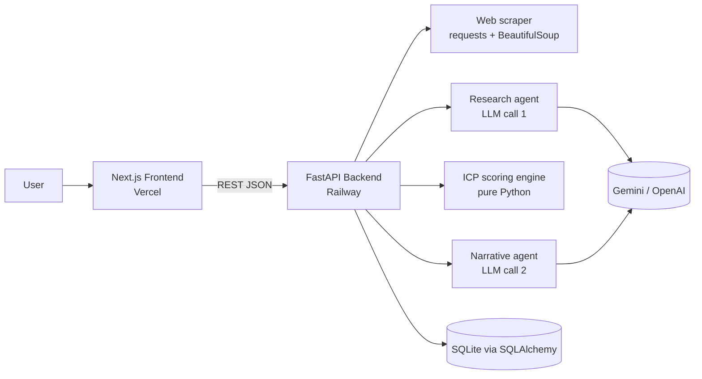

# Sales Lead Qualifier

A practical AI agent that qualifies inbound sales leads — scrapes a company's site, scores fit against a configurable ICP, and drafts a tailored outreach email.


---

## Demo

**Live app:** https://lead-qualifier-iota.vercel.app/

A user enters a company name, website, industry, and optional notes, then either selects a built-in ICP preset (e.g. *B2B SaaS Agency*, *Marketing Services*) or configures their own. Submitting the form runs the full pipeline: the backend scrapes the homepage and a few informational subpaths, asks an LLM to extract structured research, scores ICP fit deterministically in Python, and returns a single response containing a lead score (0–100), a Hot/Warm/Cold qualification, a confidence score, an ICP fit breakdown, confirmed and inferred signals, a research summary, and a ready-to-edit outreach email. Past runs are saved to a history view, individual leads can be opened on a detail page, and a bulk page accepts a CSV of leads and exports the qualified results back out as CSV.

---

## What it does

The application takes a small amount of user input — company name, website, industry, optional notes, and an Ideal Customer Profile — and produces a structured, auditable assessment of how well the lead fits the user's offer. It separates research from scoring on purpose: the LLM is responsible for understanding what the company appears to do (summary, business model, evidence snippets, served industries), while ICP fit is scored entirely in Python against the supplied profile. This means the score is reproducible, the breakdown is inspectable per-category, and the LLM cannot inflate or anchor the number.

ICP fit is scored across five categories — industry match, company type, geography, business model, and budget signals — with red flags applying a capped penalty. Confidence is also computed deterministically from measurable evidence density (text length, vocabulary richness, evidence snippets, served industries, business-model resolution) rather than self-reported by the LLM, which previously anchored close to the same value for almost every site.

The final lead score is a weighted blend of ICP fit and confidence, gated by dual thresholds so a high blended score with weak underlying fit cannot reach Hot. After scoring, a second LLM call writes the narrative sections — company summary, pain points, opportunities, reasoning, and outreach email — grounded in the same evidence the scorer used. Bulk processing accepts a CSV upload, runs each row through the same pipeline with progress reporting, and exports a CSV of results.

When a homepage cannot be fetched (for example, sites behind Cloudflare bot protection that return 403 to non-browser clients), the system records a low confidence score and returns an honest fallback narrative instead of inventing pain points from the company name alone.

---

## Architecture



The frontend is a Next.js App Router application that talks to a FastAPI backend over JSON. The backend orchestrates a four-stage pipeline: scrape, research, score, narrative. Scoring is deterministic Python; the LLM is used only for understanding and writing. Results are persisted to SQLite for the history and detail views.

---

## Tech stack

| Layer | Technology | Purpose |
| --- | --- | --- |
| Frontend framework | Next.js 15 (App Router), React 19, TypeScript 5 | Pages, routing, type safety |
| Styling | Tailwind CSS 3.4, CVA, tailwind-merge | Utility styling and component variants |
| UI primitives | Radix UI (Label, Select, Tabs, Tooltip, Progress, Separator, Slot), Lucide React, Sonner | Accessible components, icons, toasts |
| Frontend utilities | PapaParse | CSV parse and export for the bulk page |
| Backend framework | FastAPI 0.115, Uvicorn | HTTP API and ASGI server |
| Validation | Pydantic 2 | Request/response schemas |
| Persistence | SQLAlchemy 2, SQLite | Saved leads, history, detail pages |
| Scraping | requests, BeautifulSoup4, lxml | Homepage and subpath fetch + extraction |
| LLM | Google Gemini 2.0 Flash Lite (preferred), OpenAI GPT-4o mini (fallback), mock mode | Research and narrative generation |
| Deployment | Vercel (frontend), Railway (backend) | Production hosting |

---

## How it works

1. The user lands on the form, picks an ICP preset or configures one manually, and enters company details.
2. The frontend POSTs to `/qualify-lead` on the backend.
3. The scraper fetches the homepage and up to three informational subpaths (`/about`, `/products`, `/pricing`, etc.) using browser-like headers to reduce CDN bot blocking, then extracts visible text.
4. The research agent sends the combined text to the LLM and parses a structured `ResearchResult` (summary, description, business model, evidence snippets, served industries).
5. Confidence is computed deterministically from the scraped text and the research result.
6. The ICP scoring engine runs in pure Python against the supplied ICP, using ecommerce-vs-platform archetype detection so a payments platform isn't credited as a retailer just because it mentions retail customers.
7. A blended lead score is computed from ICP fit and confidence and mapped to Hot, Warm, or Cold using dual-gate thresholds.
8. A second LLM call writes the narrative — summary, company type, pain points, opportunities, reasoning, and a complete outreach email — grounded in the scoring evidence.
9. The full result is saved to SQLite and returned to the frontend, which renders the score, breakdown, signals, research, and outreach email.

---

## Local development

### Prerequisites
- Python 3.11 or newer
- Node.js 18 or newer
- An optional Gemini or OpenAI API key (without one, the app runs in mock mode)

### Backend

```bash
python -m venv .venv
.venv\Scripts\activate           # Windows
# source .venv/bin/activate      # macOS/Linux

pip install -r requirements.txt

# Create .env in the project root and add an API key
# OPENAI_API_KEY=sk-...   or   GEMINI_API_KEY=...

uvicorn app.main:app --reload
```

API runs on `http://localhost:8000`. The four endpoints are `GET /health`, `POST /qualify-lead`, `GET /leads`, and `GET /lead/{id}`.

### Frontend

```bash
cd frontend-next
npm install

# Create .env.local
# NEXT_PUBLIC_API_URL=http://localhost:8000

npm run dev
```

UI runs on `http://localhost:3000`.

---

## Environment variables

| Key | Required | Purpose |
| --- | --- | --- |
| `GEMINI_API_KEY` | One of these two for real LLM output | Google Gemini 2.0 Flash Lite. Used in preference to OpenAI when both are set. |
| `OPENAI_API_KEY` | One of these two for real LLM output | OpenAI GPT-4o mini fallback. |
| `NEXT_PUBLIC_API_URL` | Yes (frontend) | URL of the deployed backend, e.g. `https://your-backend.up.railway.app`. |

Without any LLM key the backend falls back to mock responses; deterministic scoring still runs end-to-end.

---

## Deployment

The frontend is deployed on **Vercel** with the project root set to `frontend-next`. The single production environment variable is `NEXT_PUBLIC_API_URL`, pointing at the deployed backend.

The backend is deployed on **Railway** as a Python service. The start command is `uvicorn app.main:app --host 0.0.0.0 --port $PORT`, with `OPENAI_API_KEY` (or `GEMINI_API_KEY`) set in the Railway dashboard. Production CORS origins for the deployed frontend are configured in `app/main.py`.

SQLite is suitable for the demo and a single-instance deployment; for multi-user production it should be swapped for a managed Postgres instance.

---

## Project structure

```
.
├── app/                              # FastAPI backend
│   ├── main.py                       # API routes, CORS, startup
│   ├── schemas.py                    # Pydantic request/response models
│   ├── prompts.py                    # Research + narrative prompt templates
│   ├── db.py                         # SQLAlchemy engine and session
│   ├── models.py                     # ORM model for the Lead table
│   └── services/
│       ├── tools.py                  # Multi-page web scraper
│       ├── research_agent.py         # LLM research + deterministic confidence
│       ├── icp_scoring.py            # Pure-Python ICP fit engine
│       ├── lead_qualifier.py         # Pipeline orchestrator
│       ├── llm.py                    # LLM client (Gemini / OpenAI / mock)
│       └── storage.py                # DB read/write helpers
│
├── frontend-next/                    # Next.js 15 frontend
│   ├── app/
│   │   ├── page.tsx                  # Qualify a single lead
│   │   ├── history/page.tsx          # Past runs table
│   │   ├── bulk/page.tsx             # CSV upload + batch results
│   │   └── leads/[id]/page.tsx       # Lead detail view
│   ├── components/                   # UI primitives, result cards, ICP panel
│   ├── services/api.ts               # Typed API client
│   └── types/lead.ts                 # TypeScript mirrors of backend schemas
│
├── requirements.txt                  # Python dependencies
├── .env.example                      # Backend env template
└── README.md
```

---

## Key design decisions

**Scoring is deterministic and lives outside the LLM.** ICP fit and confidence are computed in Python from scraped evidence and the user-supplied profile. The LLM is asked to *understand* the company and to *write* about the result, not to assign the score. This makes outputs reproducible and the breakdown auditable per-category.

**Multi-page scraping with browser-like headers.** Modern marketing sites are often thin SPAs whose homepage HTML alone is near-empty. The scraper fetches the homepage plus a small set of informational subpaths and uses real-Chrome headers (User-Agent, Accept, Sec-Fetch-*, client hints) to reduce bot blocking from CDNs.

**Archetype-aware ICP scoring.** The scorer detects whether a site is a direct consumer seller (cart, checkout, shop, size guide signals) or a vendor platform (API, SDK, for-businesses, request-a-demo signals) and uses that to credit or decline ecommerce/DTC ICP terms. A payments platform is not scored as a retailer just because it serves retailers.

**Honest fallback for blocked sites.** When a homepage cannot be fetched at all, the system returns confidence 5 with a canned, accurate narrative rather than letting the LLM invent pain points from the company name. Bot-protected sites stay clearly distinguishable from genuinely poor fits.

**Dual-gate qualification thresholds.** A high blended score alone does not earn a *Hot* label; the underlying ICP fit must also exceed a floor. This prevents weak fits with high research confidence from being mis-promoted.

**Conservative tech choices for a portfolio project.** SQLite, FastAPI, plain SQLAlchemy, and Next.js App Router were chosen over heavier infrastructure (Postgres, Celery, LangGraph, etc.) because the product priorities are correctness and structured outputs, not scale.

---

## Portfolio context

This project was built by **M. Hussain** as a portfolio demonstration of practical AI product thinking, backend engineering, and full-stack execution. It is intentionally scoped as a single-agent system with a deterministic scoring core rather than a complex multi-agent framework, and prioritises grounded outputs, structured responses, and an honest UX over flashier capabilities.

---

## Licence

No licence specified yet.
